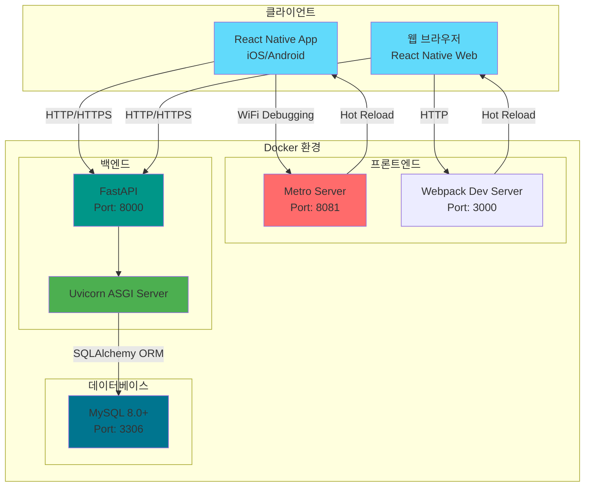
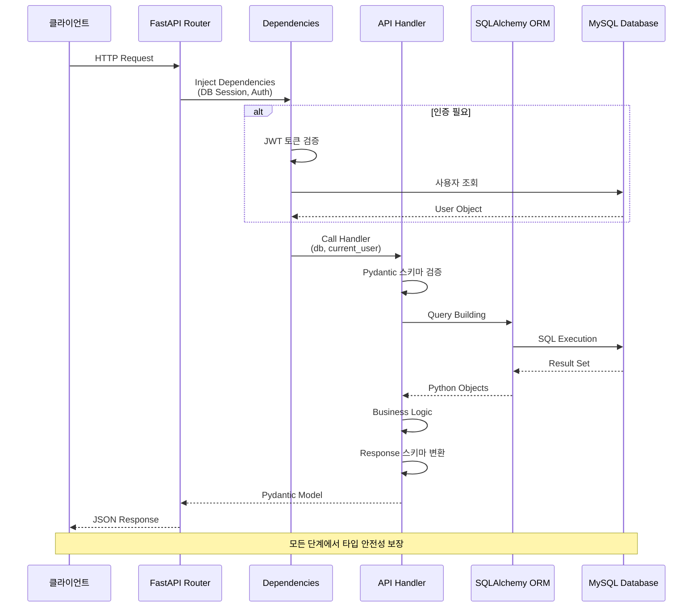
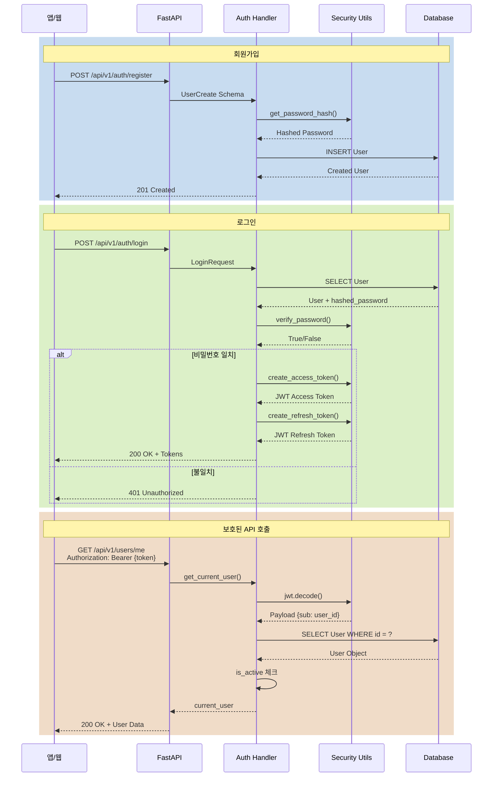
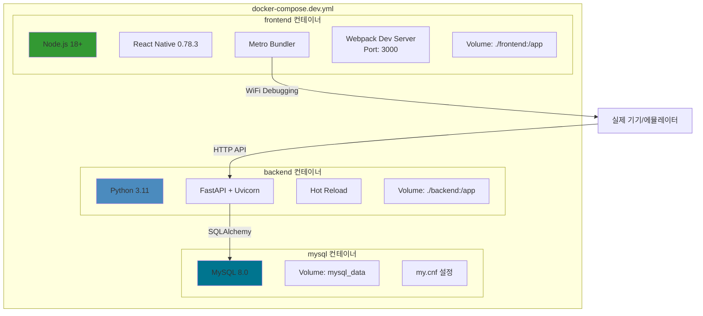
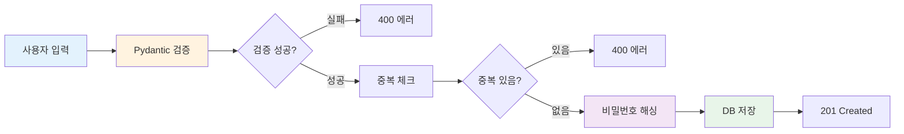
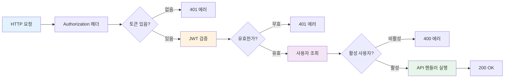
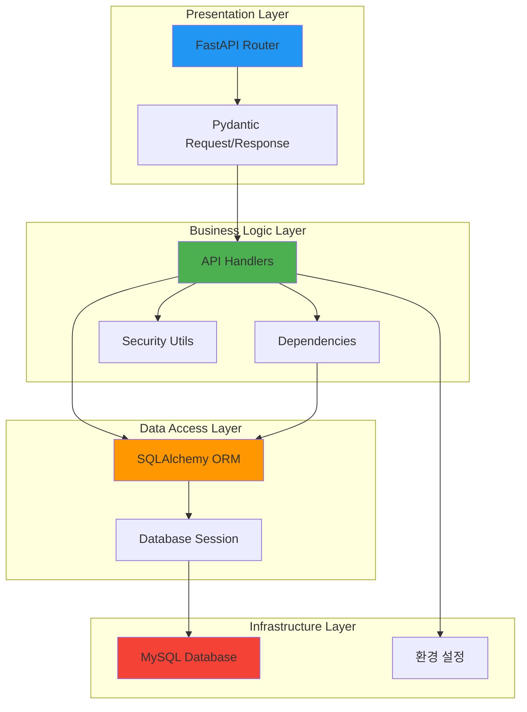

# 시스템 아키텍처

이 문서는 프로젝트의 전체 아키텍처를 설명합니다.

## 📊 전체 시스템 구조



## 🔄 요청 처리 플로우



## 🔐 인증 플로우



## 🐳 Docker 컨테이너 구조



## 📁 프로젝트 구조

```
fullstack_template/
├── backend/                    # FastAPI 백엔드
│   ├── app/
│   │   ├── api/               # API 라우터
│   │   │   ├── deps.py        # 의존성 (인증 등)
│   │   │   └── v1/            # API v1
│   │   │       ├── auth.py    # 인증 API
│   │   │       └── users.py   # 사용자 API
│   │   ├── core/              # 핵심 기능
│   │   │   └── security.py    # JWT, 비밀번호 해싱
│   │   ├── models/            # SQLAlchemy 모델
│   │   │   └── user.py
│   │   ├── schemas/           # Pydantic 스키마
│   │   │   └── user.py
│   │   ├── config.py          # 환경 설정
│   │   ├── database.py        # DB 연결
│   │   └── main.py            # FastAPI 앱
│   ├── tests/                 # pytest 테스트
│   │   └── conftest.py        # 테스트 픽스처
│   ├── mysql/                 # MySQL 설정
│   │   └── my.cnf
│   └── requirements.txt
│
├── frontend/                   # React Native 프론트엔드
│   ├── MobileApp/             # React Native 프로젝트
│   │   ├── android/           # Android 네이티브
│   │   ├── ios/               # iOS 네이티브
│   │   ├── public/            # 웹 정적 파일
│   │   ├── __tests__/         # Jest 테스트
│   │   ├── App.tsx            # 메인 앱
│   │   ├── index.js           # RN 엔트리
│   │   ├── index.web.js       # Web 엔트리
│   │   ├── webpack.config.js  # 웹 번들러
│   │   └── package.json
│   ├── templates/             # 인증 템플릿 (참고용)
│   │   ├── api.ts
│   │   ├── authService.ts
│   │   ├── AuthContext.tsx
│   │   └── LoginScreen.tsx
│   └── Dockerfile.dev
│
├── docs/                       # 문서
│   ├── ARCHITECTURE.md        # 이 파일
│   ├── DATABASE_SCHEMA.md     # DB 스키마
│   ├── TDD.md                 # TDD 가이드
│   └── ...
│
├── scripts/                    # 유틸리티 스크립트
│   ├── backup-mysql.sh
│   └── check-secrets.sh
│
├── .claude/                    # Claude Code 설정
│   ├── settings.json
│   └── hooks/
│
├── docker-compose.yml          # 프로덕션
├── docker-compose.dev.yml      # 개발
├── CLAUDE.md                   # 협업 규칙
└── README.md
```

## 🔀 데이터 흐름

### 1. 회원가입 플로우



### 2. 보호된 API 접근



## 🎯 레이어 아키텍처



## 🔧 기술 스택

### 백엔드
- **Framework**: FastAPI 0.115.6 (Python 3.11+)
- **ORM**: SQLAlchemy 2.0.36
- **DB Driver**: PyMySQL
- **Validation**: Pydantic v2
- **Auth**: python-jose (JWT)
- **Password**: passlib + bcrypt
- **Testing**: pytest + coverage
- **Server**: Uvicorn (ASGI)

### 프론트엔드
- **Framework**: React Native 0.75+
- **Language**: TypeScript 5.3+
- **HTTP Client**: Axios
- **Navigation**: React Navigation
- **State**: (선택 가능)

### 인프라
- **Container**: Docker + Docker Compose
- **Database**: MySQL 8.0+ (utf8mb4, Asia/Seoul)
- **Development**: VS Code Dev Containers
- **VCS**: Git + Conventional Commits

## 📝 주요 설계 원칙

### 1. Docker-First Development
- 모든 개발 환경은 Docker 컨테이너
- "내 컴퓨터에선 되는데" 문제 제거
- WiFi 디버깅으로 완전한 Docker 개발

### 2. Test-Driven Development (TDD)
- 테스트 먼저 → 구현 → 리팩토링
- Given-When-Then 패턴
- 커버리지 80% 이상 필수

### 3. Type Safety
- Python: 타입 힌트 필수
- TypeScript: any 금지
- Pydantic으로 런타임 검증

### 4. Security-First
- JWT 인증 (Access 30분, Refresh 7일)
- bcrypt 비밀번호 해싱
- ORM으로 SQL Injection 방지
- 환경 변수로 민감 정보 관리

### 5. Clean Code
- 함수 최대 50줄
- Single Responsibility
- Guard Clause 패턴
- 매직 넘버 상수화

## 🚀 확장 포인트

### 추가 가능한 기능들

1. **캐싱 레이어**
   ```
   FastAPI → Redis → MySQL
   ```

2. **비동기 작업**
   ```
   Celery + Redis/RabbitMQ
   ```

3. **파일 스토리지**
   ```
   AWS S3 / MinIO
   ```

4. **실시간 통신**
   ```
   WebSocket (FastAPI)
   ```

5. **검색 엔진**
   ```
   Elasticsearch
   ```

6. **모니터링**
   ```
   Sentry (에러 추적)
   Prometheus + Grafana (메트릭)
   ```

## 📚 관련 문서

- [데이터베이스 스키마](DATABASE_SCHEMA.md)
- [TDD 가이드](TDD.md)
- [보안 가이드](SECURITY.md)
- [개발 환경 설정](DEVELOPMENT.md)
- [협업 규칙](../CLAUDE.md)

---

**마지막 업데이트**: 2025-01-17
