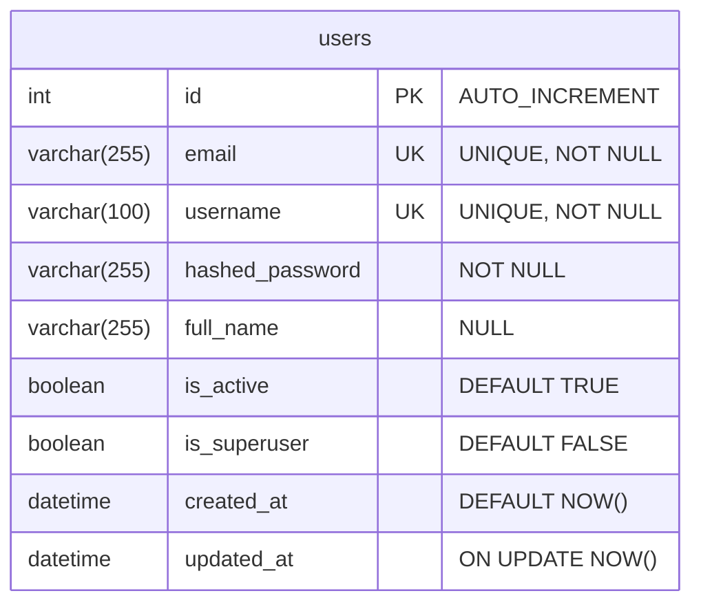
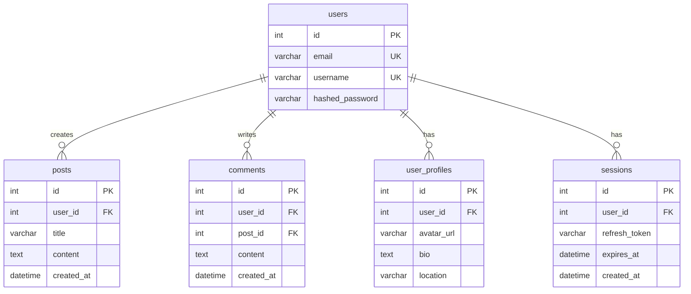

# 데이터베이스 스키마

이 문서는 데이터베이스 구조와 관계를 설명합니다.

## 📊 ER 다이어그램 (현재)



## 🗂️ 테이블 상세

### users (사용자)

사용자 인증 및 프로필 정보를 저장하는 핵심 테이블입니다.

#### 컬럼 정의

| 컬럼명 | 타입 | 제약 조건 | 설명 |
|--------|------|-----------|------|
| `id` | INT | PRIMARY KEY, AUTO_INCREMENT | 사용자 고유 식별자 |
| `email` | VARCHAR(255) | UNIQUE, NOT NULL, INDEX | 이메일 주소 (로그인 ID로 사용 가능) |
| `username` | VARCHAR(100) | UNIQUE, NOT NULL, INDEX | 사용자명 (로그인 ID로 사용 가능) |
| `hashed_password` | VARCHAR(255) | NOT NULL | bcrypt 해시된 비밀번호 (평문 저장 금지!) |
| `full_name` | VARCHAR(255) | NULL | 사용자 실명 (선택 사항) |
| `is_active` | BOOLEAN | DEFAULT TRUE | 활성 상태 (소프트 삭제에 사용) |
| `is_superuser` | BOOLEAN | DEFAULT FALSE | 관리자 권한 여부 |
| `created_at` | DATETIME | DEFAULT NOW() | 계정 생성 시각 |
| `updated_at` | DATETIME | ON UPDATE NOW() | 마지막 수정 시각 |

#### 인덱스

```sql
-- 자동 생성 인덱스
PRIMARY KEY (id)
UNIQUE INDEX idx_users_email (email)
UNIQUE INDEX idx_users_username (username)

-- 추가 권장 인덱스 (많은 쿼리가 필요한 경우)
-- INDEX idx_users_is_active (is_active)
-- INDEX idx_users_created_at (created_at)
```

#### 제약 조건

- **email**: 이메일 형식 검증은 애플리케이션 레벨(Pydantic)에서 수행
- **username**: 최소 3자, 최대 100자 (Pydantic에서 검증)
- **hashed_password**: 최소 8자 평문 비밀번호 → bcrypt 해시 (60자)

#### DDL (생성 쿼리)

```sql
CREATE TABLE users (
    id INT AUTO_INCREMENT PRIMARY KEY,
    email VARCHAR(255) UNIQUE NOT NULL,
    username VARCHAR(100) UNIQUE NOT NULL,
    hashed_password VARCHAR(255) NOT NULL,
    full_name VARCHAR(255) DEFAULT NULL,
    is_active BOOLEAN DEFAULT TRUE,
    is_superuser BOOLEAN DEFAULT FALSE,
    created_at DATETIME DEFAULT CURRENT_TIMESTAMP,
    updated_at DATETIME DEFAULT NULL ON UPDATE CURRENT_TIMESTAMP,

    INDEX idx_users_email (email),
    INDEX idx_users_username (username)
) ENGINE=InnoDB DEFAULT CHARSET=utf8mb4 COLLATE=utf8mb4_unicode_ci;
```

#### 샘플 데이터

```sql
-- 테스트 사용자 (비밀번호: testpass123)
-- bcrypt 해시 생성: get_password_hash("testpass123")
INSERT INTO users (email, username, hashed_password, full_name, is_active, is_superuser)
VALUES (
    'test@example.com',
    'testuser',
    '$2b$12$[EXAMPLE_HASH_60_CHARS_BCRYPT_HASH_REDACTED_FOR_SECURITY]',
    'Test User',
    TRUE,
    FALSE
);

-- 관리자 사용자 (비밀번호: adminpass123)
-- bcrypt 해시 생성: get_password_hash("adminpass123")
INSERT INTO users (email, username, hashed_password, full_name, is_active, is_superuser)
VALUES (
    'admin@example.com',
    'admin',
    '$2b$12$[EXAMPLE_HASH_60_CHARS_BCRYPT_HASH_REDACTED_FOR_SECURITY]',
    'Admin User',
    TRUE,
    TRUE
);
```

## 🔄 확장 가능한 스키마 (예시)

향후 기능 추가 시 다음과 같은 테이블들을 추가할 수 있습니다:



### posts (게시글) - 예시

```sql
CREATE TABLE posts (
    id INT AUTO_INCREMENT PRIMARY KEY,
    user_id INT NOT NULL,
    title VARCHAR(255) NOT NULL,
    content TEXT NOT NULL,
    is_published BOOLEAN DEFAULT FALSE,
    created_at DATETIME DEFAULT CURRENT_TIMESTAMP,
    updated_at DATETIME DEFAULT NULL ON UPDATE CURRENT_TIMESTAMP,

    FOREIGN KEY (user_id) REFERENCES users(id) ON DELETE CASCADE,
    INDEX idx_posts_user_id (user_id),
    INDEX idx_posts_created_at (created_at),
    INDEX idx_posts_is_published (is_published)
) ENGINE=InnoDB DEFAULT CHARSET=utf8mb4 COLLATE=utf8mb4_unicode_ci;
```

### user_profiles (사용자 프로필) - 예시

```sql
CREATE TABLE user_profiles (
    id INT AUTO_INCREMENT PRIMARY KEY,
    user_id INT NOT NULL UNIQUE,
    avatar_url VARCHAR(500) DEFAULT NULL,
    bio TEXT DEFAULT NULL,
    location VARCHAR(255) DEFAULT NULL,
    website VARCHAR(255) DEFAULT NULL,
    created_at DATETIME DEFAULT CURRENT_TIMESTAMP,
    updated_at DATETIME DEFAULT NULL ON UPDATE CURRENT_TIMESTAMP,

    FOREIGN KEY (user_id) REFERENCES users(id) ON DELETE CASCADE,
    INDEX idx_user_profiles_user_id (user_id)
) ENGINE=InnoDB DEFAULT CHARSET=utf8mb4 COLLATE=utf8mb4_unicode_ci;
```

## 🎯 쿼리 패턴

### 자주 사용되는 쿼리

#### 1. 로그인 (username 또는 email)

```sql
-- ORM
user = db.query(User).filter(
    (User.username == login_data.username) | (User.email == login_data.username)
).first()

-- RAW SQL
SELECT * FROM users
WHERE (username = ? OR email = ?)
LIMIT 1;
```

#### 2. 활성 사용자 조회

```sql
-- ORM
user = db.query(User).filter(User.id == user_id, User.is_active == True).first()

-- RAW SQL
SELECT * FROM users
WHERE id = ? AND is_active = TRUE
LIMIT 1;
```

#### 3. 이메일 중복 확인

```sql
-- ORM
existing = db.query(User).filter(User.email == email).first()

-- RAW SQL
SELECT * FROM users
WHERE email = ?
LIMIT 1;
```

#### 4. 사용자 정보 업데이트

```sql
-- ORM
user.email = new_email
user.full_name = new_name
db.commit()

-- RAW SQL
UPDATE users
SET email = ?, full_name = ?, updated_at = NOW()
WHERE id = ?;
```

#### 5. 소프트 삭제 (비활성화)

```sql
-- ORM
user.is_active = False
db.commit()

-- RAW SQL
UPDATE users
SET is_active = FALSE, updated_at = NOW()
WHERE id = ?;
```

## 🔍 성능 최적화

### 인덱스 전략

#### 현재 인덱스
- `PRIMARY KEY (id)`: 단일 사용자 조회
- `UNIQUE INDEX (email)`: 로그인, 중복 체크
- `UNIQUE INDEX (username)`: 로그인, 중복 체크

#### 추가 고려사항

```sql
-- 활성 사용자 필터링이 많은 경우
CREATE INDEX idx_users_is_active ON users(is_active);

-- 최근 가입자 조회가 많은 경우
CREATE INDEX idx_users_created_at ON users(created_at DESC);

-- 관리자 필터링이 많은 경우
CREATE INDEX idx_users_is_superuser ON users(is_superuser);

-- 복합 인덱스 (활성 상태 + 생성 시각)
CREATE INDEX idx_users_active_created ON users(is_active, created_at DESC);
```

### 쿼리 최적화 팁

1. **SELECT 절 최적화**
   ```python
   # ❌ 나쁜 예 (모든 컬럼)
   users = db.query(User).all()

   # ✅ 좋은 예 (필요한 컬럼만)
   users = db.query(User.id, User.username, User.email).all()
   ```

2. **N+1 문제 방지**
   ```python
   # ❌ N+1 문제
   users = db.query(User).all()
   for user in users:
       print(user.posts)  # 각 사용자마다 쿼리 실행

   # ✅ Eager Loading
   from sqlalchemy.orm import joinedload
   users = db.query(User).options(joinedload(User.posts)).all()
   ```

3. **페이지네이션**
   ```python
   # ✅ 항상 페이지네이션 적용
   users = db.query(User).limit(20).offset(page * 20).all()
   ```

## 🛡️ 보안 고려사항

### 1. 비밀번호 저장
```python
# ✅ bcrypt 해시 사용
from passlib.context import CryptContext
pwd_context = CryptContext(schemes=["bcrypt"])
hashed = pwd_context.hash(plain_password)
```

### 2. SQL Injection 방지
```python
# ✅ ORM 사용 (자동 파라미터 바인딩)
user = db.query(User).filter(User.email == email).first()

# ❌ 절대 금지
db.execute(f"SELECT * FROM users WHERE email = '{email}'")
```

### 3. 소프트 삭제
```python
# ✅ is_active = False로 비활성화
user.is_active = False

# ❌ 실제 DELETE는 신중히 (관련 데이터 처리 필요)
db.delete(user)
```

## 📋 마이그레이션

### Alembic 사용

```bash
# 마이그레이션 파일 생성
alembic revision --autogenerate -m "Add users table"

# 마이그레이션 적용
alembic upgrade head

# 롤백
alembic downgrade -1
```

### 마이그레이션 예시

```python
# alembic/versions/xxx_add_users_table.py
def upgrade():
    op.create_table(
        'users',
        sa.Column('id', sa.Integer(), nullable=False),
        sa.Column('email', sa.String(255), nullable=False),
        sa.Column('username', sa.String(100), nullable=False),
        sa.Column('hashed_password', sa.String(255), nullable=False),
        sa.Column('full_name', sa.String(255), nullable=True),
        sa.Column('is_active', sa.Boolean(), server_default='1'),
        sa.Column('is_superuser', sa.Boolean(), server_default='0'),
        sa.Column('created_at', sa.DateTime(), server_default=sa.text('NOW()')),
        sa.Column('updated_at', sa.DateTime(), onupdate=sa.text('NOW()')),
        sa.PrimaryKeyConstraint('id'),
        sa.UniqueConstraint('email'),
        sa.UniqueConstraint('username')
    )
    op.create_index('idx_users_email', 'users', ['email'])
    op.create_index('idx_users_username', 'users', ['username'])

def downgrade():
    op.drop_index('idx_users_username', 'users')
    op.drop_index('idx_users_email', 'users')
    op.drop_table('users')
```

## 📚 관련 문서

- [아키텍처](ARCHITECTURE.md)
- [API 문서](../README.md#api-endpoints)
- [보안 가이드](SECURITY.md)
- [개발 가이드](DEVELOPMENT.md)

---

**마지막 업데이트**: 2025-01-17
